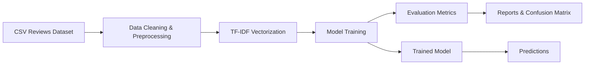
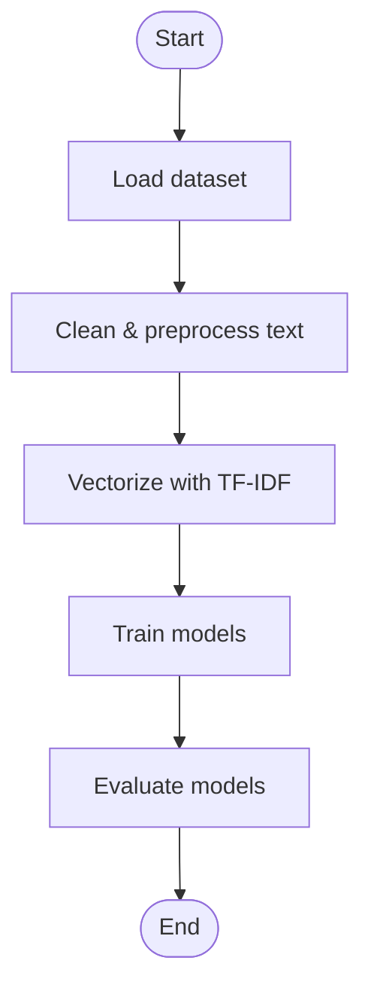
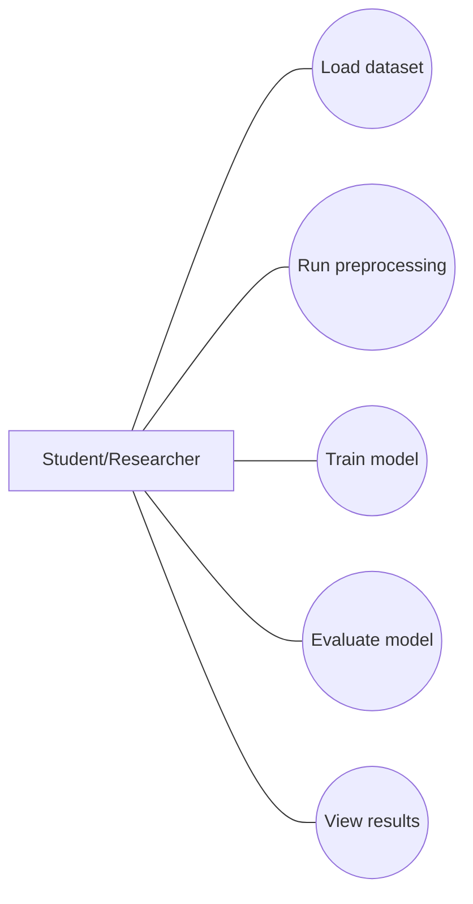

# Machine Learning Project Documentation

## Title Page

**Project Title:** Sentiment Analysis Using Machine Learning  
**Submitted by:**  
Student Name: ______________________________  
ID Number: _________________________________  
Department: Computer Science  
Institution: University Name  
Degree: Bachelor of Science (BSc) in Computer Science  
Submission Date: Month, Year

---

## Abstract

This project implements a sentiment analysis system that classifies short text reviews into positive, negative, and neutral categories using supervised machine learning. A small dataset of product and service reviews is cleaned, normalized, and transformed into TF-IDF features. Two classification models, Multinomial Naive Bayes and Logistic Regression, are trained and evaluated on a stratified train-test split. The project demonstrates the end-to-end machine learning pipeline, highlights the impact of preprocessing on data quality, and provides a baseline for extending the system to larger datasets and more advanced models.

---

## Chapter 1: Introduction

### 1.1 Background of the Study
Sentiment analysis is a natural language processing (NLP) task that determines the emotional tone of text. It is widely used in business, education, and social media to understand opinions, measure satisfaction, and support decision-making. With the growing volume of user-generated content, automated sentiment classification has become essential.

### 1.2 Problem Statement
Manual analysis of large volumes of text reviews is time-consuming and inconsistent. There is a need for an automated approach that can accurately classify sentiments in short text reviews to support timely decision-making.

### 1.3 Aim of the Project
To design and implement a machine learning-based sentiment analysis system that classifies short text reviews into positive, negative, and neutral sentiments.

### 1.4 Objectives of the Study
- Collect and prepare a dataset of short text reviews with sentiment labels.
- Clean and normalize text data to remove noise and inconsistencies.
- Convert text into numeric features using TF-IDF.
- Train and evaluate supervised learning models.
- Analyze results and discuss model performance.

### 1.5 Scope of the Study
The project focuses on a small dataset of product and service reviews. It applies classical machine learning algorithms and TF-IDF features. Deep learning models and large-scale deployment are outside the scope.

### 1.6 Significance of the Study
The project demonstrates practical application of data preprocessing, feature engineering, and supervised learning. It provides a foundation for students to understand real-world text mining workflows.

---

## Chapter 2: Literature Review

### 2.1 Introduction to Machine Learning
Machine learning is a branch of artificial intelligence that enables computers to learn from data and make predictions without being explicitly programmed. Supervised learning is widely used for classification tasks such as sentiment analysis.

### 2.2 Supervised Learning
Supervised learning uses labeled data to train models. Algorithms such as Naive Bayes and Logistic Regression are effective for text classification due to their simplicity and strong performance on high-dimensional sparse data.

### 2.3 Machine Learning in Education
In educational contexts, machine learning supports automated grading, learning analytics, and sentiment analysis of student feedback. This helps institutions identify challenges and improve instructional quality.

---

## Chapter 3: Methodology

### 3.1 Data Collection
The dataset used contains short product and service reviews with three labels: positive, negative, and neutral. The data is stored in `data/sample_reviews.csv`.

### 3.2 Data Preprocessing
Key preprocessing steps include:
- Removing missing values and duplicate rows.
- Converting text to lowercase.
- Removing URLs, mentions, hashtags, numbers, and non-alphabetic characters.
- Removing extra whitespace.
- **Tokenization:** The cleaned text is split into tokens (words) by the TF-IDF vectorizer during feature extraction.
- **Sentiment labeling:** Each review is assigned a sentiment label (`positive`, `negative`, `neutral`) in the dataset, which is used as the target for supervised learning.

### 3.3 Machine Learning Algorithms Used
- **Multinomial Naive Bayes**: A probabilistic classifier commonly used for text classification.
- **Logistic Regression**: A linear classifier that performs well with TF-IDF features.

### 3.4 Model Training
The dataset is split into training and testing sets (80/20) using stratified sampling. TF-IDF features with unigrams and bigrams are used for model training.

### 3.5 Evaluation Metrics
Models are evaluated using:
- Accuracy
- Precision, Recall, and F1-score
- Confusion Matrix

---

## Chapter 4: System Design

### 4.1 System Architecture
The system follows a pipeline architecture:
1. Data input (CSV file)
2. Preprocessing
3. Feature extraction (TF-IDF)
4. Model training
5. Prediction and evaluation

**Architecture Diagram (Mermaid):**



### 4.2 System Flow Diagram
**Flow Diagram (Mermaid):**



### 4.3 Use Case Diagram
Actors: Student/Researcher
Use cases:
- Load dataset
- Run preprocessing
- Train model
- Evaluate model
- View results

**Use Case Diagram (Mermaid):**



---

## Chapter 5: Implementation

### 5.1 Development Tools
- **Programming Language:** Python 3
- **Libraries:** pandas, numpy, scikit-learn, regex
- **Environment:** Jupyter Notebook / Python script
- **IDE/Editor:** VS Code

### 5.2 Programming
The core training script is located in `sentiment_analysis_project.py`. It performs dataset loading, preprocessing, feature extraction, model training, and evaluation.

**Code used for training the model:**

```python
import re
from typing import Tuple

import numpy as np
import pandas as pd
from sklearn.feature_extraction.text import TfidfVectorizer
from sklearn.linear_model import LogisticRegression
from sklearn.metrics import classification_report, confusion_matrix
from sklearn.model_selection import train_test_split
from sklearn.naive_bayes import MultinomialNB


def load_dataset(path: str) -> pd.DataFrame:
    df = pd.read_csv(path)
    df = df.dropna(subset=["text", "sentiment"])
    df = df.drop_duplicates(subset=["text", "sentiment"])
    return df


def clean_text(text: str) -> str:
    text = text.lower()
    text = re.sub(r"http\S+|www\S+", " ", text)
    text = re.sub(r"@[\w_]+", " ", text)
    text = re.sub(r"#[\w_]+", " ", text)
    text = re.sub(r"[^a-z\s]", " ", text)
    text = re.sub(r"\s+", " ", text).strip()
    return text


def preprocess_dataset(df: pd.DataFrame) -> pd.DataFrame:
    df = df.copy()
    df["clean_text"] = df["text"].astype(str).apply(clean_text)
    df = df[df["clean_text"].str.len() > 0]
    return df


def vectorize_text(train_text, test_text):
    vectorizer = TfidfVectorizer(
        stop_words="english",
        ngram_range=(1, 2),
        min_df=1,
    )
    X_train = vectorizer.fit_transform(train_text)
    X_test = vectorizer.transform(test_text)
    return X_train, X_test, vectorizer


def train_and_evaluate_models(X_train, X_test, y_train, y_test):
    models = {
        "Naive Bayes (MultinomialNB)": MultinomialNB(),
        "Logistic Regression": LogisticRegression(max_iter=1000),
    }

    for name, model in models.items():
        print("=" * 80)
        print(f"Model: {name}")
        model.fit(X_train, y_train)
        y_pred = model.predict(X_test)
        print("\nClassification report:")
        print(classification_report(y_test, y_pred))
        print("Confusion matrix:")
        print(confusion_matrix(y_test, y_pred, labels=sorted(y_test.unique())))
        print()


def main():
    data_path = "data/sample_reviews.csv"
    df = load_dataset(data_path)
    df_clean = preprocess_dataset(df)

    X_train_text, X_test_text, y_train, y_test = train_test_split(
        df_clean["clean_text"],
        df_clean["sentiment"],
        test_size=0.2,
        random_state=42,
        stratify=df_clean["sentiment"],
    )

    X_train, X_test, _ = vectorize_text(X_train_text, X_test_text)
    train_and_evaluate_models(X_train, X_test, y_train, y_test)


if __name__ == "__main__":
    main()
```

---

## Chapter 6: Results and Discussion

After running the script, the models generate a classification report and confusion matrix. Typical observations are:
- Logistic Regression often performs slightly better than Naive Bayes on TF-IDF features.
- Neutral reviews are harder to classify compared to positive and negative classes.

**Actual metrics (from latest run):**

- Accuracy (Naive Bayes): 0.4000
- Accuracy (Logistic Regression): 0.2000
- Precision/Recall/F1 table:

Naive Bayes (MultinomialNB)

              precision    recall  f1-score   support
    negative       0.33      0.50      0.40         2
     neutral       0.00      0.00      0.00         1
    positive       0.50      0.50      0.50         2

    accuracy                           0.40         5
   macro avg       0.28      0.33      0.30         5
weighted avg       0.33      0.40      0.36         5

Logistic Regression

              precision    recall  f1-score   support
    negative       0.00      0.00      0.00         2
     neutral       0.00      0.00      0.00         1
    positive       0.33      0.50      0.40         2

    accuracy                           0.20         5
   macro avg       0.11      0.17      0.13         5
weighted avg       0.13      0.20      0.16         5

---

## Chapter 7: Conclusion and Recommendations

### Conclusion
The project successfully demonstrates a sentiment analysis pipeline using classical machine learning algorithms. The combination of text preprocessing and TF-IDF feature extraction produces meaningful results on the dataset. The system is simple, reproducible, and can be extended to larger datasets.

### Recommendations
- Use a larger and more diverse dataset to improve generalization.
- Experiment with advanced models such as Support Vector Machines or neural networks.
- Add hyperparameter tuning to optimize model performance.

---

## References

1. Géron, A. (2022). *Hands-On Machine Learning with Scikit-Learn, Keras, and TensorFlow*. O’Reilly.
2. Witten, I. H., Frank, E., & Hall, M. A. (2011). *Data Mining: Practical Machine Learning Tools and Techniques*. Morgan Kaufmann.
3. Han, J., Kamber, M., & Pei, J. (2022). *Data Mining: Concepts and Techniques*. Morgan Kaufmann.

---

## Appendices

### Appendix A – Dataset
- File: `data/sample_reviews.csv`
- Description: Short product/service review texts labeled as positive, negative, or neutral.

### Appendix B – Source Code
- File: `sentiment_analysis_project.py`

### Appendix C – System Screenshots
- Placeholder for screenshots of training output, confusion matrices, or notebook results.

---

## Notes (Submission Requirements)
- Total number of pages must not exceed 20 pages including cover, references, and appendices.
- Submit the documentation during the date slotted for the exam.
- Make a PowerPoint presentation and submit a day before the exam.
- Submit a README file containing the GitHub link to the source code a day before the exam.
- Submit to email: abkamara@unimak.edu.sl
